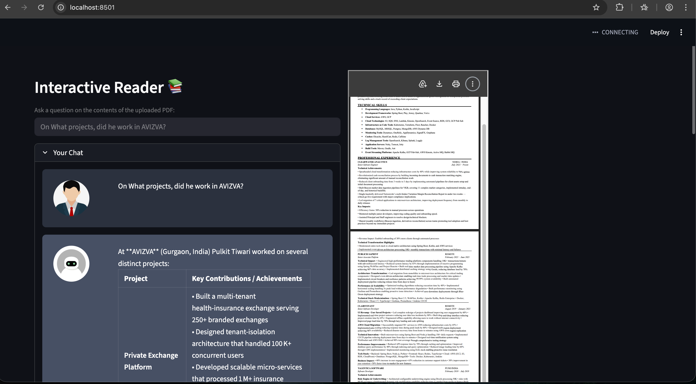

# Chat with PDF

AI-powered PDF reader built with LangChain and Streamlit. Upload PDFs and chat with your documents using natural language.

[](https://python.org)
[](https://streamlit.io)
[](https://langchain.com)
[](LICENSE)

## Features

- **RAG-based Q&A** - Get accurate answers using Retrieval-Augmented Generation
- **Source Citations** - See exactly which parts of the PDF were used to answer
- **Interactive UI** - Clean Streamlit interface for easy document interaction
- **Multi-PDF Support** - Chat with multiple documents simultaneously
- **Persistent Chat History** - Conversation context is maintained throughout the session

## Use Cases

- Research paper analysis
- Legal document review
- Contract summarization
- Quick insights from reports and manuals

## Tech Stack

| Component | Technology |
|-----------|------------|
| Framework | [Streamlit](https://streamlit.io) |
| LLM Orchestration | [LangChain](https://langchain.com) |
| Embeddings | OpenAI / HuggingFace |
| Vector Store | FAISS / Chroma |

## Prerequisites

- Python 3.8+
- OpenAI API key (or other LLM provider)

## Installation

1. Clone the repository:
   ```bash
   git clone https://github.com/i-am-pulkit-tiwari/chat-with-pdf.git
   cd chat-with-pdf
   ```

2. Install dependencies:
   ```bash
   pip install -r requirements.txt
   ```

3. Set up your API keys:
   ```bash
   export OPENAI_API_KEY="your-api-key-here"
   ```

## Usage

Run the Streamlit app:

```bash
streamlit run app.py
```

Then open your browser to `http://localhost:8501` and:
1. Upload your PDF(s)
2. Wait for processing to complete
3. Start asking questions in natural language

## Configuration

Create a `.env` file for local configuration:

```env
OPENAI_API_KEY=your_key_here
LLM_MODEL=gpt-4
EMBEDDING_MODEL=text-embedding-3-small
```

## Project Structure

```
chat-with-pdf/
├── app.py                 # Main Streamlit application
├── requirements.txt       # Python dependencies
├── src/
│   ├── pdf_loader.py      # PDF text extraction
│   ├── embeddings.py      # Vector embedding logic
│   └── chat_engine.py     # RAG pipeline
└── README.md
```

## Contributing

Contributions are welcome! Please feel free to submit a Pull Request.

## License

This project is licensed under the GNU General Public License v3.0 - see the [LICENSE](LICENSE) file for details.


## DEMO
